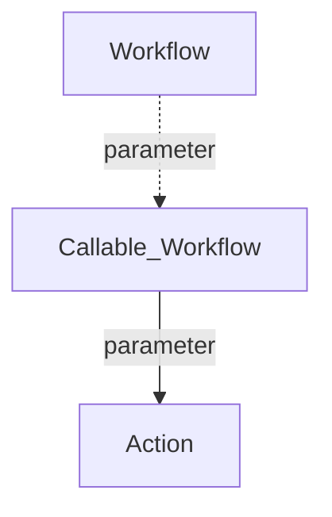

<div id="top" align="center">
<h1>GH Repo README Template</h1>

<p>Template for new Github repos</p>

[Report Issues](https://github.com/Zheng-Bote/repo-template/issues)&nbsp;[Request Feature](https://github.com/Zheng-Bote/repo-template/pulls)

[](https://choosealicense.com/licenses/mit/)
[](https://choosealicense.com/licenses/apache/)


</div>

<hr>
<!-- START doctoc generated TOC please keep comment here to allow auto update -->
<!-- DON'T EDIT THIS SECTION, INSTEAD RE-RUN doctoc TO UPDATE -->
**Table of Contents**

- [Description](#description)
- [Status](#status)

<!-- END doctoc generated TOC please keep comment here to allow auto update -->
<hr>

## Description


description of this

### Features

- [x] works as designed
- [ ] no bugs

<p align="right">(<a href="#top">back to top</a>)</p>

## Status


[](https://github.com/Zheng-Bote/repo-template/actions/workflows/repo-create_doctoc.yml)

<p align="right">(<a href="#top">back to top</a>)</p>

## Installation

bla bla

### Dependencies

bla bla

### folder structure

used folder structure

```bash
.
├── assets
│   ├── css
│   │   └── index.css
│   ├── img
│   │   ├── information-outline.svg
│   │   ├── mail-open-outline.svg
│   └── js
│       └── rz-footer.js
├── favicon.ico
└── index.html

```

<p align="right">(<a href="#top">back to top</a>)</p>

## Usage/Examples

```html
<body id="body">
  <main id="main">
    <h1>Hello World 你好世界 Hola Mundo Привет мир Hallo Welt!</h1>
  </main>
  <rz-footer
    name="ZHENG Robert"
    created="2016"
    version="v0.1.0"
    link_left="/contact.html"
    link_right="/legal-notice.html"
  ></rz-footer>

  <script src="./assets/js/rz-footer.js"></script>
</body>
```

<p align="right">(<a href="#top">back to top</a>)</p>

## API Reference

### Parameters

<!-- onöly for actions repo-->
<!-- ## Inputs -->

<!-- ## Outputs -->

```
    <rz-footer></rz-footer>
```

```
    <rz-footer
      name="ZHENG Robert"
      created="2016"
      version="v0.1.0"
      link_left="/contact.html"
      link_right="/legal-notice.html"
    >
    </rz-footer>
```

| Parameter    | Type     | Description                             |
| :----------- | :------- | :-------------------------------------- |
| `name`       | `string` | **Optional**. name-of-copyright-holder  |
| `created`    | `string` | **Optional**. <YYYY>                    |
| `version`    | `string` | **Optional**. <v0.0.0>                  |
| `link_left`  | `string` | **Optional**. link-to-contact-page      |
| `link_right` | `string` | **Optional**. link-to-legal-notice-page |

<p align="right">(<a href="#top">back to top</a>)</p>

## Documentation



### Github Page

[](https://linktodocumentation)

see also: [https://linktodocumentation](https://linktodocumentation)

> [!NOTE]
> Useful information that users should know, even when skimming content.

> [!TIP]
> Helpful advice for doing things better or more easily.

> [!IMPORTANT]
> Key information users need to know to achieve their goal.

> [!WARNING]
> Urgent info that needs immediate user attention to avoid problems.

> [!CAUTION]
> Advises about risks or negative outcomes of certain actions.

<p align="right">(<a href="#top">back to top</a>)</p>

## Screenshots


<p align="right">(<a href="#top">back to top</a>)</p>

## Authors and License

### License

#### Apache 2.0

Copyright [yyyy] [name of copyright owner]

Licensed under the Apache License, Version 2.0 (the "License");
you may not use this file except in compliance with the License.
You may obtain a copy of the License at

       http://www.apache.org/licenses/LICENSE-2.0

Unless required by applicable law or agreed to in writing, software
distributed under the License is distributed on an "AS IS" BASIS,
WITHOUT WARRANTIES OR CONDITIONS OF ANY KIND, either express or implied.
See the License for the specific language governing permissions and
limitations under the License.

#### MIT

MIT License

Copyright (c) [year] [fullname]

Permission is hereby granted, free of charge, to any person obtaining a copy
of this software and associated documentation files (the "Software"), to deal
in the Software without restriction, including without limitation the rights
to use, copy, modify, merge, publish, distribute, sublicense, and/or sell
copies of the Software, and to permit persons to whom the Software is
furnished to do so, subject to the following conditions:

The above copyright notice and this permission notice shall be included in all
copies or substantial portions of the Software.

THE SOFTWARE IS PROVIDED "AS IS", WITHOUT WARRANTY OF ANY KIND, EXPRESS OR
IMPLIED, INCLUDING BUT NOT LIMITED TO THE WARRANTIES OF MERCHANTABILITY,
FITNESS FOR A PARTICULAR PURPOSE AND NONINFRINGEMENT. IN NO EVENT SHALL THE
AUTHORS OR COPYRIGHT HOLDERS BE LIABLE FOR ANY CLAIM, DAMAGES OR OTHER
LIABILITY, WHETHER IN AN ACTION OF CONTRACT, TORT OR OTHERWISE, ARISING FROM,
OUT OF OR IN CONNECTION WITH THE SOFTWARE OR THE USE OR OTHER DEALINGS IN THE
SOFTWARE.

        https://choosealicense.com/licenses/mit/

### Authors

- [](https://www.github.com/Zheng-Bote)

### Code Contributors


[Zheng-Bote](https://www.github.com/Zheng-Bote)

<hr>

:vulcan_salute:

<p align="right">(<a href="#top">back to top</a>)</p>
