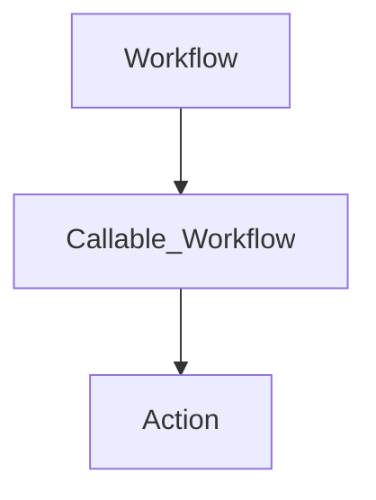

<div id="top" align="center">
<h1>GH Repo README Template</h1>

<p>Template for new Github repos</p>

[Issues](https://github.com/Zheng-Bote/repo-template/issues)&nbsp;[Requests](https://github.com/Zheng-Bote/repo-template/pulls)

[](https://choosealicense.com/licenses/mit/)


</div>

<hr>
<!-- START doctoc generated TOC please keep comment here to allow auto update -->
<!-- DON'T EDIT THIS SECTION, INSTEAD RE-RUN doctoc TO UPDATE -->
**Table of Contents**

- [Description](#description)
- [Status](#status)

<!-- END doctoc generated TOC please keep comment here to allow auto update -->
<hr>

## Description

description of this

### Features

- [x] works as designed
- [ ] no bugs

## Status

[](https://github.com/Zheng-Bote/repo-template/actions/workflows/repo-create_doctoc.yml)

## Installation

used folder structure

```bash
.
├── assets
│   ├── css
│   │   └── index.css
│   ├── img
│   │   ├── information-outline.svg
│   │   ├── mail-open-outline.svg
│   └── js
│       └── rz-footer.js
├── favicon.ico
└── index.html

```

## Usage/Examples

```html
<body id="body">
  <main id="main">
    <h1>Hello World 你好世界 Hola Mundo Привет мир Hallo Welt!</h1>
  </main>
  <rz-footer
    name="ZHENG Robert"
    created="2016"
    version="v0.1.0"
    link_left="/contact.html"
    link_right="/legal-notice.html"
  ></rz-footer>

  <script src="./assets/js/rz-footer.js"></script>
</body>
```

## API Reference

#### Parameters

```
    <rz-footer></rz-footer>
```

```
    <rz-footer
      name="ZHENG Robert"
      created="2016"
      version="v0.1.0"
      link_left="/contact.html"
      link_right="/legal-notice.html"
    >
    </rz-footer>
```

| Parameter    | Type     | Description                             |
| :----------- | :------- | :-------------------------------------- |
| `name`       | `string` | **Optional**. name-of-copyright-holder  |
| `created`    | `string` | **Optional**. <YYYY>                    |
| `version`    | `string` | **Optional**. <v0.0.0>                  |
| `link_left`  | `string` | **Optional**. link-to-contact-page      |
| `link_right` | `string` | **Optional**. link-to-legal-notice-page |

## Documentation



### Github Page

[Documentation](https://linktodocumentation)

> [!NOTE]
> Useful information that users should know, even when skimming content.

> [!TIP]
> Helpful advice for doing things better or more easily.

> [!IMPORTANT]
> Key information users need to know to achieve their goal.

> [!WARNING]
> Urgent info that needs immediate user attention to avoid problems.

> [!CAUTION]
> Advises about risks or negative outcomes of certain actions.

## Screenshots


## Authors and License

[MIT](https://choosealicense.com/licenses/mit/)

- [@Zheng-Bote](https://www.github.com/Zheng-Bote)

<hr>
